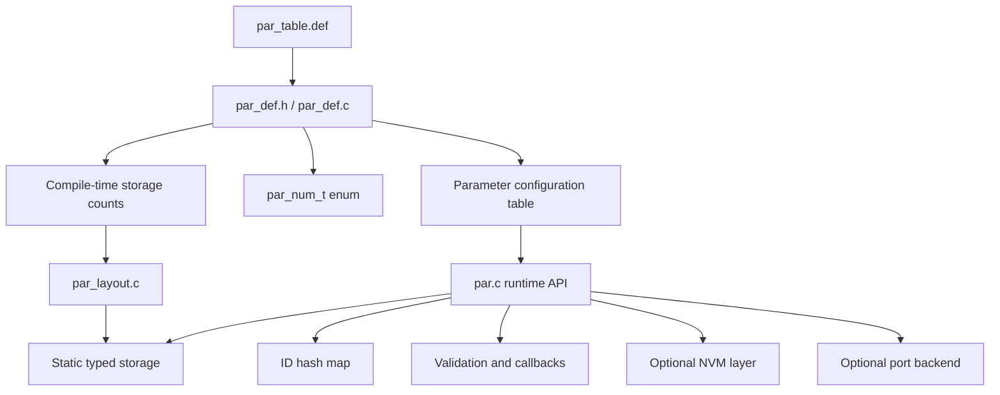
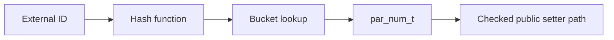

# Architecture

This document explains how the module is structured internally and how the major pieces work together.

## High-level model

The module separates four concerns:

1. **Generated parameter definition** through `par_table.def`, generated enums, and generated config structs
2. **Core runtime access** through `src/par.c`, `include/par.h`, and private implementation fragments included only by `src/par.c`
3. **Layout and storage** through `par_layout.*` and compile-time storage initialization fragments
4. **Optional platform and NVM integration** through `par_if.*`, `par_atomic.h`, and `par_nvm.*`

Runtime validation hooks and on-change hooks are kept separate from the core `par_cfg_t` metadata table and can be compiled out independently.



## Single-source parameter definition

`par_table.def` is intentionally included multiple times with different macro definitions.

That makes one definition file drive multiple generated artifacts:

- `par_num_t` enumeration in `par_def.h`
- configuration table access through `par_def.c`
- compile-time validation for integer parameter ranges
- compile-time storage group counts for layout
- fail-fast compile-time rejection for disabled `F32` entries

This design reduces duplication and helps keep enum values, metadata, and storage assumptions aligned.

### Why disabled `F32` still appears in enum expansion

`par_def.h` intentionally keeps enum expansion configuration-independent.

That keeps `par_num_t` generation stable and avoids include-order coupling with `par_cfg.h`.

The fail-fast rule is enforced later in `par_def.c`: if `F32` support is disabled and `par_table.def` still contains `PAR_ITEM_F32(...)`, compilation stops with a static assertion.


## Object parameter framework

The original runtime stores scalar parameters in grouped `u8`, `u16`, and `u32` arrays.

Object parameters reuse the same layout scan, but keep their live payload bytes out-of-line in one shared object pool. Each object parameter also owns one runtime slot descriptor containing its pool offset, current payload length, and reserved capacity.

Supported object types are `STR`, `BYTES`, `ARR_U8`, `ARR_U16`, and `ARR_U32`.

The generated `par_cfg_t` stores type-specific metadata in `value_cfg.scalar` or `value_cfg.object`. These two metadata shapes are mutually exclusive for one row, so the table stores them in a union.

See [Object parameters](object-parameters.md) for the dedicated storage model, read/write flow, array handling, and current NVM limitation.

## Internal vs external identification

The module uses two identifiers for each parameter.

### `par_num_t`

`par_num_t` is the internal firmware-facing identifier.

Use it when code inside the firmware directly accesses parameters.

Characteristics:

- dense enum-like index
- efficient for table-based access
- not intended to be stable across arbitrary reordering of the parameter list

### `id`

`id` is the external identifier stored in parameter metadata.

Use it when parameters must be addressed by external systems such as:

- CLI commands
- PC tools
- diagnostic frames
- protocol bridges

This separation lets firmware use an efficient internal index while external tooling uses a stable numeric contract.

## Storage model

The module stores live values in static width-based groups instead of allocating each parameter separately on the heap.

Storage groups:

- 8-bit group for `U8`, `I8`
- 16-bit group for `U16`, `I16`
- 32-bit group for `U32`, `I32`, and, when enabled, `F32`

Benefits:

- predictable RAM usage
- no runtime heap dependency for live storage
- compact grouping by data width

At runtime, each parameter resolves to:

- a storage group based on its type
- an offset inside that group

### How default values are applied at startup

Live storage is initialized in two phases during startup:

1. Integer default values from `par_table.def` are compiled directly into the grouped live storage object in `par.c`.
2. When `PAR_CFG_ENABLE_TYPE_F32 = 1`, `F32` default values are written into the grouped 32-bit storage member after layout offsets are available.

The compile-time integer storage initializers are emitted through a private include fragment, `src/detail/par_storage_init.inc`, which is included only by `par.c` and initializes the grouped storage object (`U8/U16/U32` members).

When `PAR_CFG_ENABLE_RESET_ALL_RAW = 1`, `par.c` keeps a grouped default mirror snapshot for raw reset. The snapshot preserves the same `U8/U16/U32` width-group storage semantics.

This means `par_init()` does not need to apply startup defaults through the public setter path for every parameter.

### Ordering contract for shared storage

Within each width-based storage group, element order follows `par_table.def` entry order filtered by the types supported by that group.

That ordering contract matters because:

- compile-time integer default initializers depend on it
- runtime layout offset generation depends on it
- both sides must stay aligned so each parameter lands in the correct slot

If the filtered storage order and the runtime layout scan order ever diverge, defaults can be written into the wrong storage positions.

## Layout subsystem
When `PAR_CFG_ENABLE_TYPE_F32 = 1`, the layout step also makes it possible to patch `F32` defaults correctly, because floating-point values share the 32-bit storage group and need their final offsets first.

The layout subsystem provides the offset map that connects each parameter to its location in the static typed storage.

The layout step is also what makes it possible to patch `F32` defaults correctly, because floating-point values share the 32-bit storage group and need their final offsets first.

### Compile-scan mode

When:

```c
#define PAR_CFG_LAYOUT_SOURCE PAR_CFG_LAYOUT_COMPILE_SCAN
```

`par_layout_init()` scans the parameter table during initialization and builds offsets dynamically.

Use this mode when you want a self-contained integration with no external code generation step.

### Script-layout mode

When:

```c
#define PAR_CFG_LAYOUT_SOURCE PAR_CFG_LAYOUT_SCRIPT
```

layout data is provided by a generated static header and consumed directly.

Use this mode when your tooling already owns parameter generation or when you want fixed layout data before compilation.

## Validation model

Validation happens in two stages.

### Compile-time validation

Compile-time validation is used for integer parameter types:

- `U8`
- `I8`
- `U16`
- `I16`
- `U32`
- `I32`

Typical checks include:

- `range.min <= range.max`
- `def >= range.min`
- `def <= range.max`

These checks are generated from `par_table.def`, so invalid integer configurations fail at build time.

`F32` range checks are still not evaluated as compile-time constant expressions.

However, when `PAR_CFG_ENABLE_TYPE_F32 = 0`, any `PAR_ITEM_F32(...)` entry is rejected at compile time through a static assertion. This keeps `par_def.h` configuration-independent while still failing fast in `par_def.c`.

### Runtime validation

Runtime validation is used for checks that are better handled dynamically, including:

- floating-point range validation
- `name != NULL` when name metadata is enabled
- `desc != NULL` when description metadata is enabled
- description policy checks through `par_port_is_desc_valid()` when enabled
- per-parameter application validation callbacks when `PAR_CFG_ENABLE_RUNTIME_VALIDATION = 1`

This split keeps integer configuration errors out of the firmware image while still allowing flexible runtime policies. Runtime validation callbacks can be compiled out independently from the rest of the metadata model.

## ID lookup path

The module supports ID-based APIs such as `par_get_num_by_id()`, `par_get_id_by_num()`, scalar wrappers `par_get_scalar_by_id()` and `par_set_scalar_by_id()`, and object wrappers such as `par_get_str_by_id()` / `par_set_str_by_id()`. Generic scalar entry points remain scalar-only, while object rows use dedicated object typed APIs by parameter number or external ID. All public checked scalar write APIs (`par_set_scalar()`, `par_set_scalar_by_id()`, and typed scalar setters) converge on the same checked setter core, while the checked getter paths still enforce the external read bit before returning live data.

Because external IDs do not need to be sequential, the build generates a static hash map from `par_table.def`. `par_init()` does not build the ID map at runtime.



### Collision policy

The current implementation uses a strict one-entry-per-bucket map.

That means:

- duplicate IDs are rejected by compile-time table checks
- hash collisions are rejected by compile-time table checks
- optional runtime diagnostic scans can be enabled to print clearer startup logs for duplicate-ID and bucket-collision issues

This keeps runtime lookup simple and deterministic, but it also means a conflicting ID assignment must be fixed at the source.

### Access enforcement boundary

`par_get_access()` remains metadata, and the checked public access paths consume it directly. Supported parameter-table access modes are only `ePAR_ACCESS_RO` and `ePAR_ACCESS_RW`; `ePAR_ACCESS_NONE` and write-only access masks are rejected by compile-time table checks. Public write entry points reject `RO` rows with `ePAR_ERROR_ACCESS`. Public read entry points remain readable for every valid table row.

Fast setters and internal restore paths intentionally remain outside that checked boundary. They are used for startup/default/NVM restore flows where the firmware must rehydrate trusted values without invoking public access-control policy. The dedicated object getter APIs follow the same checked read rule and are readable for every valid object row.

### Hash geometry and collision rule

The current ID lookup implementation uses a strict one-entry-per-bucket hash map.

Each external parameter ID is mapped to a bucket with the following multiplicative hash used by both static map generation and optional runtime diagnostics:

```c
bucket = (((uint32_t)id * PAR_ID_HASH_GOLDEN_RATIO_32) >> (32u - PAR_ID_HASH_BITS));
```

Where:

* `PAR_ID_HASH_GOLDEN_RATIO_32 = 0x61C88647u`
* `PAR_ID_HASH_MIN_BUCKETS = 2 * ePAR_NUM_OF`
* `PAR_ID_HASH_BITS` is the smallest power-of-two bucket geometry that can hold at least `PAR_ID_HASH_MIN_BUCKETS`
* `PAR_ID_HASH_SIZE = 1u << PAR_ID_HASH_BITS`

This design does **not** support probing or chaining.

That means the current ID map effectively requires the active parameter table to be collision-free under the selected hash geometry:

* two rows with the same `id` are invalid
* two different `id` values that land in the same bucket are also invalid

In other words, the table must behave like a collision-free mapping for the configured bucket count.

### Compile-time and runtime enforcement

ID validity is enforced primarily at compile time:

1. compile-time duplicate-ID and hash-bucket collision checks in `par_def.c`
2. compile-time static ID-map generation in `par_id_map_static.c`
3. optional runtime diagnostic scans in `par.c`

Compile-time checks fail the build early when the parameter table already proves invalid.

Optional runtime scans do not build the ID map. They exist only to provide clearer diagnostic logs during startup when additional field debugging is useful.

### How to avoid hash collisions

When assigning or changing external IDs in `par_table.def`:

1. keep every `id` globally unique
2. avoid clustered numeric patterns that repeatedly land in the same hash bucket
3. re-run the build after every ID edit
4. if a collision is reported, change the conflicting external IDs in `par_table.def`
5. do not assume that "different IDs" are automatically safe; different IDs can still hash into the same bucket

For the current implementation, avoiding collision means avoiding both:

* duplicate `id`
* duplicate `PAR_HASH_ID_CONST(id)` result

If frequent ID churn is expected, a probing-based or chained hash map is a more scalable design than relying on a collision-free table.

## Normal path vs fast path

Depending on build-time configuration, the normal path can include runtime validation callbacks and on-change callbacks.

### Normal setters

Normal setters are the default path. They are intended for ordinary application code where correctness and observability matter more than shaving off a few instructions.

Depending on build-time configuration, the normal path can include runtime validation callbacks and on-change callbacks. On-change callbacks are dispatched synchronously after the checked scalar write has updated live storage and before the setter releases the parameter lock. Callback code should therefore avoid re-entering parameter APIs for the same parameter and should defer follow-up set/save work to application code when lock ordering cannot be proven.

The typed setter/getter implementations are emitted through `src/detail/par_typed_impl.inc`, a private include fragment included only by `scalar/par_scalar_api.c`.

### Fast setters

Fast setters are specialized APIs for controlled hot paths. They reduce overhead, but they should only be used when the surrounding code already guarantees the assumptions that the full path would normally check.

Fast setters do not execute runtime validation callbacks or on-change callbacks.

The bitwise fast helpers are emitted through `src/detail/par_bitwise_impl.inc`, another private include fragment included only by `par.c`. They are intentionally scoped as flags-only helpers for `U8` / `U16` / `U32` bitmask parameters and do not preserve normal setter range semantics.

### Raw reset-all path

When `PAR_CFG_ENABLE_RESET_ALL_RAW = 1`, `par_reset_all_to_default_raw()` is available as a storage-level reset path.

It restores live values by one grouped `memcpy` from the default mirror snapshot, while still preserving the internal `U8/U16/U32` width-group storage model. This is a recovery/maintenance path rather than an external write path, so it bypasses:

- external write-access checks
- role-policy checks
- runtime validation callbacks
- on-change callbacks
- normal setter range/flow semantics

When `PAR_CFG_ENABLE_RESET_ALL_RAW = 1`, `par_set_all_to_default()` also uses this raw reset path for performance.

## Optional NVM persistence

When `PAR_CFG_NVM_EN = 1`, the module can persist selected parameters to NVM.

NVM persistence uses a compile-time selected record layout that is intentionally different from the live RAM layout. Live RAM storage is grouped by value width (`U8` / `U16` / `U32` / optional `F32`) for efficient access and raw reset, while the managed NVM area stores a compile-time ordered slot list. The selected slot serializer can keep a fixed 4-byte payload slot with a size descriptor, keep the same fixed 4-byte payload slot without the size descriptor, store the natural payload width together with the size descriptor, store only `crc + payload` in compile-time persistent order, or store only `crc + payload` in grouped 8/16/32-bit persistent order. The two payload-only layouts intentionally rely on table-ID checking instead of per-record IDs to detect schema drift.

The compile-time persistent order is the primary layout contract of the managed NVM image. Loader and rewrite paths restore slot `i` into compile-time persistent slot `i`, while the stored `id` remains inside each object as an integrity and diagnostics field rather than as the main startup lookup key. Count asymmetry is handled intentionally: a stored count larger than the live compile-time persistent count is treated as an incompatible image and triggers full rebuild, while a stored count smaller than the live count restores the common prefix first and then appends newly introduced tail slots from current defaults only for layouts whose prefix addresses stay stable. `GROUPED_PAYLOAD_ONLY` is excluded from that repair path and rebuilds on any stored/live count mismatch. Compatibility is checked against the stored prefix for every layout. Layouts with stored IDs include parameter IDs in that prefix digest, while the payload-only layouts exclude external parameter IDs and validate only prefix byte-layout compatibility; pure external-ID renumbering therefore does not invalidate an otherwise compatible stored prefix there. The fixed-slot layouts keep one 4-byte payload slot per persistent parameter. The compact-payload layout stores only the natural 1/2/4-byte payload width and therefore saves bytes for narrow types. The fixed-slot layout without a size descriptor is intentionally not offered when a flash backend requires 8-byte aligned writes, because its serialized record width is 7 bytes.

The serialized scalar NVM header is a fixed 12-byte storage image (`sign + obj_nb + table_id + crc16`) emitted explicitly instead of by writing raw struct memory. The header CRC covers the serialized native-order `obj_nb + table_id` bytes, so header corruption is detected separately from a valid header that simply belongs to another parameter-table schema. Each scalar data object uses CRC-8 according to the selected record layout. This profile intentionally ties the persisted image to the current target architecture and does not normalize byte order for cross-platform migration. CRC calculation is routed through port hooks with bundled software defaults. The table-ID digest follows the same rule and hashes each scalar exactly as represented in native platform memory. For self-describing scalar layouts, the digest covers `PAR_CFG_TABLE_ID_SCHEMA_VER`, selected persisted record layout, scalar persistent-parameter count, scalar persistent-parameter order, parameter type, and parameter ID. For payload-only layouts, the digest covers the stored scalar persistent prefix count, scalar persistent-parameter order, and parameter type, and intentionally excludes external parameter IDs. Default values, ranges, names, units, descriptions, and access flags are intentionally excluded because they do not change the serialized scalar NVM object layout used by `par_nvm.c`. When table-ID checking is enabled, self-describing layouts treat add/remove/reorder/type/ID updates of scalar persistent parameters as incompatible schema changes, `FIXED_PAYLOAD_ONLY` allows pure external-ID renumbering and compatible tail growth without forcing a rebuild, and `GROUPED_PAYLOAD_ONLY` still rebuilds on any stored/live count mismatch. If a payload-only prefix is semantically remapped while keeping the same serialized byte layout, the integrator must bump `PAR_CFG_TABLE_ID_SCHEMA_VER` explicitly because that remap is outside the automatic byte-layout digest.

When `PAR_CFG_NVM_OBJECT_EN = 1`, persistent object rows are not inserted into the scalar layout. They are stored in a dedicated object block. `PAR_CFG_NVM_OBJECT_STORE_MODE` first selects whether the object block uses the scalar backend address space (`PAR_CFG_NVM_OBJECT_STORE_SHARED`) or a port-provided dedicated object backend or partition (`PAR_CFG_NVM_OBJECT_STORE_DEDICATED`). Shared-store mode then uses `PAR_CFG_NVM_OBJECT_ADDR_MODE`: the default `PAR_CFG_NVM_OBJECT_ADDR_AFTER_SCALAR` mode appends the object block after the current scalar block, while `PAR_CFG_NVM_OBJECT_ADDR_FIXED` uses `PAR_CFG_NVM_OBJECT_FIXED_ADDR` and can optionally check `PAR_CFG_NVM_OBJECT_REGION_SIZE`. Dedicated-store mode uses `PAR_CFG_NVM_OBJECT_DEDICATED_BASE_ADDR` inside the object backend address space and does not depend on scalar block size, so scalar and object persistence cannot overwrite each other. The object block has its own header, table-ID digest, body size, CRC-16 protected records, and fixed-capacity payload slots. Object recovery is isolated from scalar record recovery. The generic core intentionally does not migrate object blocks between addresses: on flash-class media, scalar rebuild or erase operations can destroy the old after-scalar object block before a copy is possible, and safe relocation requires product-specific scratch or double-buffer storage, commit markers, power-loss recovery, and erase-block planning. Released products that need object values to survive scalar persistent-layout growth should use fixed-address or dedicated-backend placement before deployment.

If the stored table-ID mismatches the live table-ID, the module treats the persisted image as incompatible and rebuilds the managed NVM area from current default values and the current schema. This can happen after an intentional schema/version bump, after parameter persistence layout changes, after stored-image corruption, or when the stored header count is larger than the current compile-time persistent count. If the stored count is smaller than the compile-time count, layouts with stable prefix addresses restore the stored prefix, append the missing tail slots from live defaults, and rewrite the header count to the current schema width; `GROUPED_PAYLOAD_ONLY` instead rebuilds on any stored/live count mismatch. The recovery action is centralized in `par_nvm_init()`: it accumulates status bits from header validation, table-ID validation, and payload loading, then decides whether to restore defaults only or restore defaults plus rewrite the managed NVM image.

For this feature, `par_nvm.c` mounts only the storage interfaces required by the active persistence mode. Scalar persistence and shared object persistence use the scalar storage backend interface, while dedicated object-only persistence uses dedicated object backend hooks and does not require a packaged scalar backend. The core no longer depends directly on a specific repository layout, while Kconfig selects which packaged scalar backend adapter is built when one is needed.
At the same time, the NVM core binds one compile-time selected persisted-record layout adapter. That adapter owns record address calculation, live-to-persist object preparation, stored-object validation, compatibility policy, and optional readback-compare logic. The common NVM flow therefore stays layout-agnostic even when layouts differ in stored `id`, size descriptors, prefix-append compatibility, or post-write verification semantics.
If the selected storage technology provides ECC or other media-health reporting, that signal is intentionally treated as input to the product policy rather than as an automatic parameter-core action. The business layer should decide whether to log only, rebuild/reset parameters, or escalate to a broader system-level error response.

The module intentionally keeps a compile-time ordered slot image instead of introducing a free-layout scanned log. A scanned log would make layout recovery more flexible, but it would also add boot-time scan, compaction, and tombstone handling to a path whose slot order is already fixed by the parameter table.

## Portability model

The module stays portable by keeping platform-specific logic behind dedicated boundaries.

Header placement follows the same rule: public entry and API headers stay under `include/`, while private helper headers remain next to the implementation areas that own them. The public entry point is separated from implementation sources, but the current configuration header chain still includes generated and packaged configuration headers from `src/` (`def/par_def.h` and `nvm/par_nvm_cfg.h`). The package SConscript therefore exports both `parameters/include` and `parameters/src`; custom builds should do the same until those generated/config headers are exported separately.

### Core portable layer

Implemented under layered `src/` subdirectories:

- `src/par.c`, `include/par.h`, and `include/par_cfg.h` for module lifecycle, shared core helpers, metadata APIs, and top-level orchestration
- `src/def/` for parameter definitions and generated static ID mapping
- `src/layout/` for storage layout calculation and accessors
- `src/scalar/` for scalar parameter APIs and scalar live-value storage
- `src/object/` for object parameter APIs and object-pool helpers
- `src/nvm/` for NVM persistence logic
- `src/nvm/backend/` for reusable packaged backend adapters
- `src/port/` for platform-facing hooks used by the portable core
- `src/detail/` for private implementation fragments included only by `src/par.c`

### Port-specific layer

Implemented by the integrator as needed:

- `par_cfg_port.h`
- `par_if_port.c` (optional strong override for the weak defaults in `src/port/par_if.c`, including mutex and CRC helpers)
- `par_atomic_port.h`

This separation makes the core reusable while still allowing the target platform to provide mutexes, logging, assertions, and atomic primitives. Packaged scalar storage backend adapters stay inside the `src/nvm/backend/` subtree because they are reusable module integrations rather than board-specific port code. Repository-root files under `backend/` bind those portable scalar backends to one concrete platform environment such as RT-Thread FAL or a product-specific native flash port. Dedicated object-only integrations instead provide the object backend hooks selected by the object store adapter.


## Flash-emulated EEPROM backend

See `./flash-ee-backend-design.md` for the portable core and adapter design.
