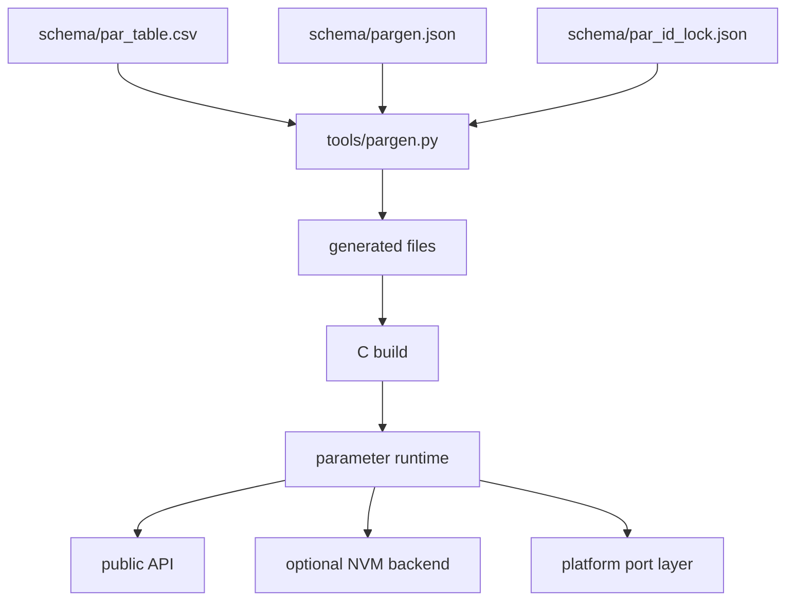
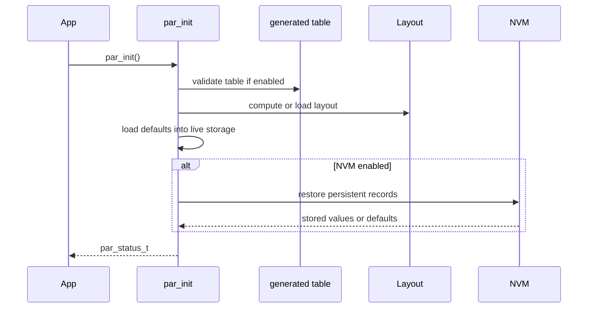

[中文](./architecture.zh-CN.md)

# Architecture

## High-level model

The module separates parameter definition, generated metadata, runtime values, optional validation, and optional NVM persistence.

## Ownership boundaries

| Layer | Owns | Should not own |
| --- | --- | --- |
| CSV table | Parameter rows, IDs, metadata, defaults, persistence intent. | Platform-specific storage operations. |
| Generator | Derived tables, ID lock updates, generated layout data. | Runtime policy decisions. |
| Core runtime | Initialization, live values, validation dispatch, metadata access, save/restore calls. | Hardware flash/I2C details. |
| Port layer | RTOS hooks, mutex, logging, atomic operations, backend binding. | Parameter definition semantics. |
| Integration layer | CLI/RPC/session role decisions and package-specific command behavior. | Core table generation rules. |

## Parameter identity

The module uses two identifiers:

- `par_num_t`: internal generated enum used by firmware code.
- `id`: stable external `uint16_t` ID used by CLI, protocols, NVM records, and tools.

Keep `PAR_CFG_ENABLE_ID` enabled when external visibility or persistent records matter.

## Storage model

Scalar live values are held in statically allocated storage grouped by width. Object values are stored in a shared fixed-capacity object pool plus object slot metadata. This avoids heap ownership in the core and makes memory use predictable.

## Initialization flow

## Validation model

Validation happens at several levels:

- Generator and compile-time checks reject malformed table definitions.
- Runtime table checks catch unsupported combinations if enabled.
- Built-in range checks protect scalar writes.
- Optional validation callbacks can reject values based on application state.
- Access and role metadata are available to integration layers; role enforcement is not a built-in session system.

## Normal setters vs fast setters

Normal setters perform the full runtime path: initialization checks, type checks, range/access checks, validation callbacks, storage update, and change callback dispatch.

Fast setters are intended for trusted internal paths that need lower overhead. They should not be exposed directly through shell, RPC, or untrusted diagnostic interfaces.

## Layout modes

| Mode | Use case |
| --- | --- |
| `PAR_CFG_LAYOUT_COMPILE_SCAN` | Simple projects that can compute layout from compiled tables. |
| `PAR_CFG_LAYOUT_SCRIPT` | Projects that require generated, reproducible layout data and stronger review of persistent offsets. |

## NVM boundary

The core persistence layer decides which parameters are persistent and how runtime values map into NVM records. Backend implementations own medium-specific behavior such as flash erase/program constraints, EEPROM access, FAL partition binding, and recovery.

See [Flash-ee backend design](./flash-ee-backend-design.md) for the flash-emulated EEPROM backend.
