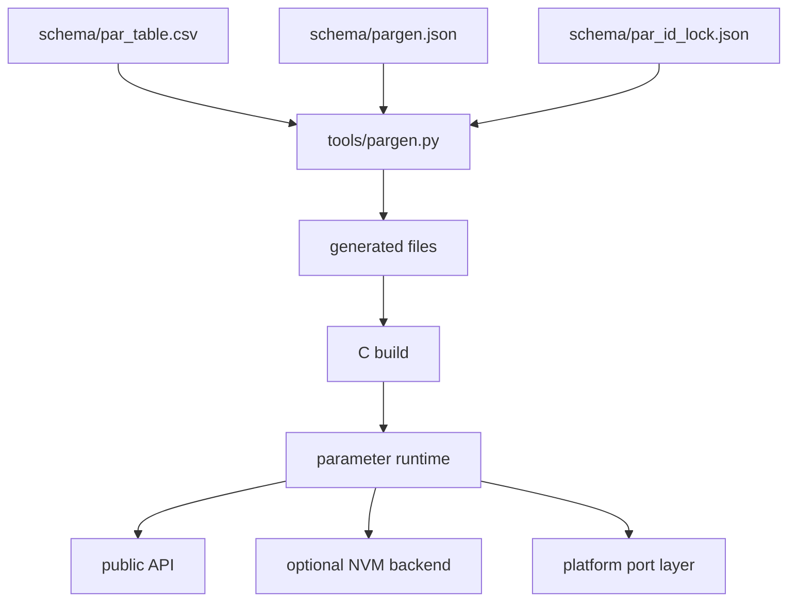
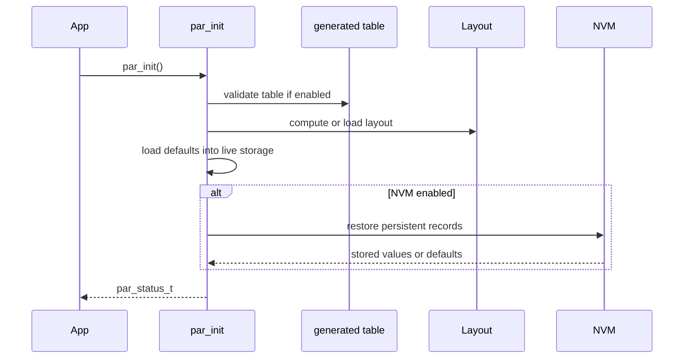

[English](./architecture.md)

# 架构

## 高层模型

模块将参数定义、生成元数据、运行时值、可选校验和可选 NVM 持久化分离。

## 所有权边界

| 层级 | 负责 | 不应负责 |
| --- | --- | --- |
| CSV 参数表 | 参数行、ID、元数据、默认值、持久化意图。 | 平台具体存储操作。 |
| 生成器 | 派生表、ID 锁更新、生成布局数据。 | 运行时策略决策。 |
| 核心运行时 | 初始化、实时值、校验派发、元数据访问、保存/恢复调用。 | 硬件 flash/I2C 细节。 |
| 移植层 | RTOS 钩子、互斥锁、日志、原子操作、后端绑定。 | 参数定义语义。 |
| 集成层 | CLI/RPC/session role 判断和软件包特定命令行为。 | 核心参数表生成规则。 |

## 参数身份

模块使用两类标识：

- `par_num_t`：内部生成 enum，供固件代码使用。
- `id`：稳定外部 `uint16_t` ID，供 CLI、协议、NVM record 和工具使用。

当参数需要外部可见或进入持久化记录时，应保持 `PAR_CFG_ENABLE_ID` 启用。

## 存储模型

标量实时值按宽度分组存放在静态存储中。对象值存放在共享定长容量对象池和对象槽元数据中。核心不持有堆内存所有权，内存占用可预测。

## 初始化流程

## 校验模型

校验发生在多个层级：

- 生成器和编译期检查拒绝不合法参数表定义。
- 启用运行期表检查后，可捕获不支持的配置组合。
- 内置 range 检查保护标量写入。
- 可选 validation callback 能基于应用状态拒绝写入值。
- access 和 role metadata 提供给集成层使用；role enforcement 不是核心内置 session 系统。

## 普通 setter 与 fast setter

普通 setter 走完整运行时路径：初始化检查、类型检查、range/access 检查、validation callback、存储更新和 change callback 派发。

Fast setter 面向可信内部路径，用于降低开销。不应直接暴露给 shell、RPC 或不可信诊断接口。

## 布局模式

| 模式 | 使用场景 |
| --- | --- |
| `PAR_CFG_LAYOUT_COMPILE_SCAN` | 简单项目，可从编译后的表计算布局。 |
| `PAR_CFG_LAYOUT_SCRIPT` | 需要生成、可复现布局数据，并加强持久化偏移审查的项目。 |

## NVM 边界

核心持久化层决定哪些参数需要持久化，以及运行时值如何映射到 NVM record。后端实现负责介质相关行为，例如 flash 擦写约束、EEPROM 访问、FAL 分区绑定和恢复。

Flash 模拟 EEPROM 后端见 [Flash-ee 后端设计](./flash-ee-backend-design.zh-CN.md)。
