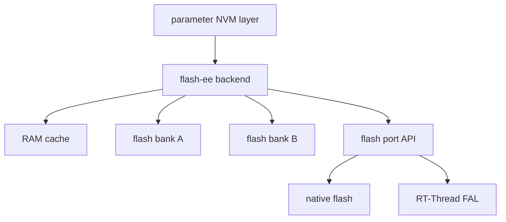
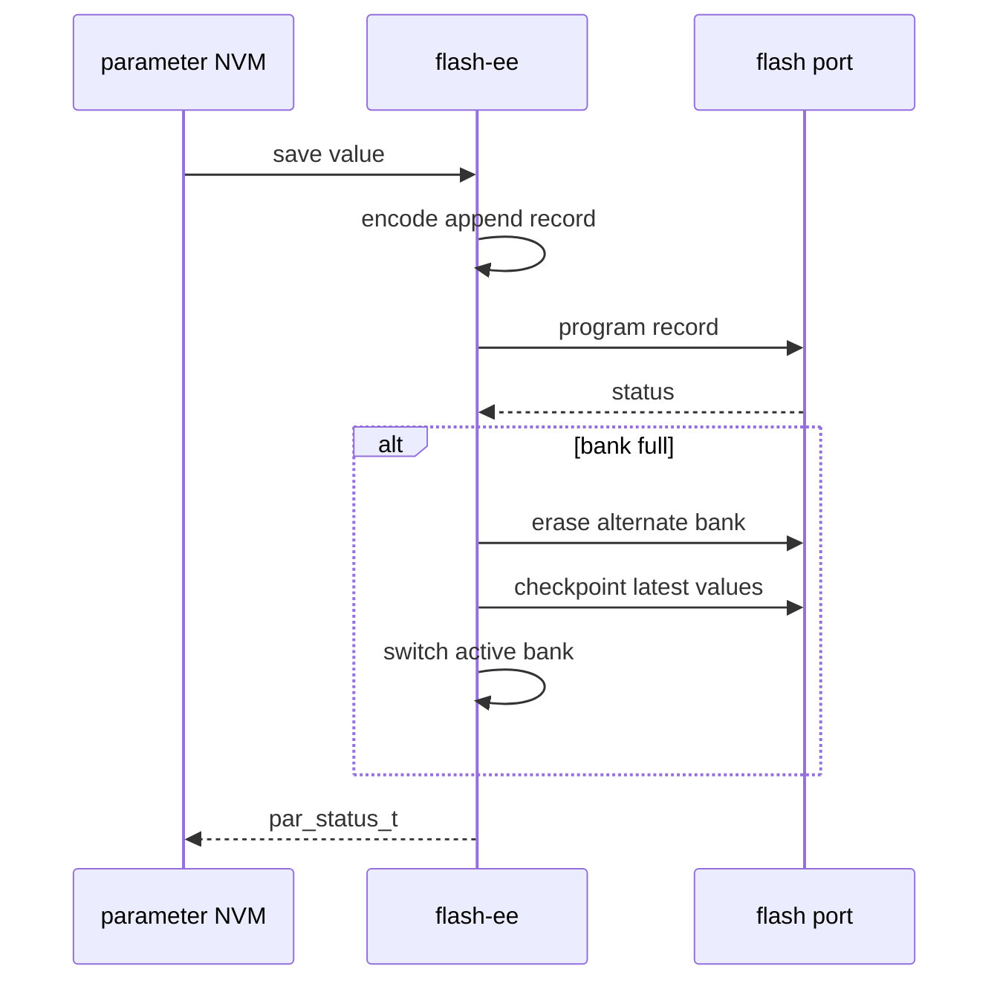

[中文](./flash-ee-backend-design.zh-CN.md)

# Flash-ee backend design

The flash-ee backend provides a flash-emulated EEPROM style persistence backend for parameter values.

## Intent

The backend is intended for flash media that require erase-before-write and benefit from append-style records. It provides a portable core plus adapter contracts for concrete storage providers such as native flash ports or RT-Thread FAL partitions.

## High-level architecture

## On-flash model

The backend uses bank metadata plus append records. New values are appended instead of rewriting records in place. When the active bank no longer has enough space, the backend can checkpoint the latest visible values into the alternate bank.

## RAM cache model

The RAM cache tracks the latest visible value for each persistent parameter. This avoids scanning the entire log for every read and keeps runtime access predictable after initialization.

## Commit and checkpoint flow

## Recovery behavior

During initialization, the backend scans bank headers and append records to select the newest valid active data set. Recovery is conservative:

- A bank with an invalid header, incompatible geometry, or unsupported format version is rejected.
- A record is visible only after its final commit unit has been fully programmed.
- A partially programmed tail record is treated as an interrupted append and ignored, so older committed values remain visible.
- A closed record with invalid metadata or CRC makes the bank fail closed instead of silently accepting corrupted history.
- When no valid bank exists, the backend formats a fresh bank and the parameter layer must rebuild values from defaults or higher-level policy.

The backend is not a transactional multi-record database. If a multi-window write or erase fails, earlier windows may already be committed while later windows still contain old data. Applications that need cross-parameter consistency should keep must-stay-consistent values inside one independently committed window when practical, or add an application-level version/commit marker.

## Request-completion semantics

For this backend, `par_nvm_write(..., false)` means the common parameter layer does not request an additional explicit sync step. It does not guarantee RAM-only staging until a later call.

- The backend may synchronize a dirty cache window before loading another window during one logical request.
- A successful write or erase returns only after the final dirty window required by that request has been made durable according to the backend contract.
- Failed multi-window requests remain non-transactional and may leave a prefix of the request committed.

## Adapter contract

A flash port adapter must provide at least:

- initialization and deinitialization
- read
- program/write
- erase
- region size
- erase size
- program size
- human-readable backend name where available

## RT-Thread adapters

This repository documents two flash-ee adapter directions for RT-Thread package integration:

| Adapter | Use case |
| --- | --- |
| FAL port | Use an RT-Thread FAL partition as the flash-ee storage region. |
| Native port | Bind directly to board-specific flash operations when FAL is not used. |

AT24CXX-style EEPROM storage is conceptually a separate backend choice and should not be treated as a flash-ee port because EEPROM write and erase semantics differ from flash.

## Integration risks

- Incorrect erase size, program size, line size, or bank size corrupts record alignment and bank selection.
- Sharing the storage region with unrelated data breaks recovery assumptions.
- Changing persistent IDs or layout without migration may orphan stored values or force a managed NVM rebuild.
- Cache/window sizing affects consistency: size the flash-ee cache so common parameter objects fit inside one window whenever practical.
- Power-loss testing must include append interruption, checkpoint interruption, bank-swap interruption, CRC failure injection, and first boot after interrupted checkpoint.
