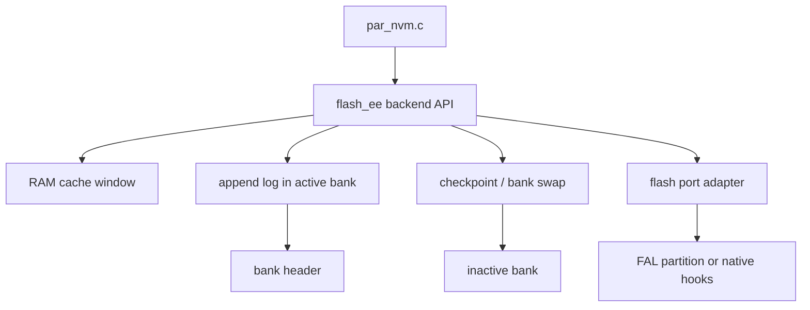

# Flash-Emulated EEPROM Backend Design

This document describes the portable flash-emulated EEPROM backend used by the parameters package. It focuses on architecture, integration contracts, runtime constraints, and the public backend-facing API.

## 1. Scope and intent

The backend exposes a byte-addressable NVM interface to `par_nvm.c`, while persisting data on erase-before-write flash media. The implementation keeps the reusable core free of RT-Thread, FAL, HAL, or vendor flash SDK dependencies. Platform-specific flash access is supplied through a thin port adapter.

The design target is parameter persistence, not a general-purpose flash translation layer. It is optimized for deterministic layout, bounded RAM, append-only commits, and simple recovery.

## 2. High-level architecture

The flash region exported by the port is split into exactly two banks:

- one **active bank** that accepts append records
- one **inactive bank** used as the checkpoint target during rollover

Each bank contains:

- one fixed header
- zero or more fixed-size append records

## 3. On-flash model

### 3.1 Bank header

The bank header stores:

- magic
- backend format version
- logical size
- line size
- record size
- bank size
- monotonic sequence number
- header CRC
- state word

A bank is considered selectable only when the header is structurally valid and matches the live geometry.

### 3.2 Append record

Each append record stores, in on-flash write order:

- one fixed-size payload block
- one metadata block containing logical line index, payload size, and one record CRC over the payload plus those semantic metadata fields
- optional erased padding used to align the final commit unit
- one dedicated commit unit written last

The payload block always has `line_size` bytes. Logical data is therefore reconstructed line-by-line rather than byte-by-byte. A record is treated as visible only when its final commit unit matches the committed pattern exactly.

## 4. RAM cache model

The backend keeps one bounded RAM cache window rather than a full logical image.

- `logical_size` is the logical EEPROM address space exported upward.
- `cache_size` is the RAM staging window size.
- `line_size` is the granularity of one cached and appended line.

The current implementation supports **exactly one dirty cache window at a time**.

### Practical consequence

- `read()` may reconstruct data outside the currently loaded clean window.
- `write()` and `erase()` may span multiple cache windows.
- before staging moves to a new window, the backend synchronizes the current dirty window automatically.
- a successful multi-window write or erase returns only after the final dirty window is synchronized as well.

This is still a bounded single-window staging design, not a transparent multi-window write-back cache. It improves durability-on-success, but it is still not a transactional multi-window commit engine.

## 5. Initialization and bank selection

At init time the backend:

1. binds and initializes the physical flash port
2. validates geometry and compile-time configuration
3. scans both banks
4. chooses the newest valid active bank by sequence number
5. formats bank 0 when neither bank is valid

### Accepted end-of-log conditions during scan

A bank scan stops successfully only when it reaches one of these conditions:

1. one fully erased record slot, meaning the append log ended normally
2. one or more programmed slots whose final commit unit was never fully completed

Any slot whose commit unit still contains erased bytes is treated as an uncommitted append and ignored during reconstruction. Any slot with a closed but invalid commit unit, and any committed record with invalid metadata or record CRC, makes the bank unusable. The record CRC covers the payload, logical line index, and payload size so corrupted metadata cannot silently redirect a valid payload to the wrong logical line. This fail-closed rule avoids silently accepting corrupted committed history while still tolerating interrupted appends.

The append-record CRC semantics in backend format version `1` are part of the persisted-image contract, so banks written with incompatible record-integrity rules must still be rejected by the header version check and reformatted rather than being misinterpreted under a different integrity rule.

## 6. Commit and checkpoint flow

### 6.1 Normal sync

`sync()` converts each dirty cache line into one append record in the active bank.

For each appended line, the write order is:

1. program the payload bytes
2. program the metadata block and any erased alignment padding
3. program the dedicated commit unit last

There is no in-place record repair path. If power is lost before the final commit write completes, the partially written slot is treated as an uncommitted append and skipped during the next scan. Later sync operations append into subsequent free slots; cleanup happens only when checkpoint or bank rollover compacts the live image.

### 6.2 Rollover / checkpoint

When the active bank does not have enough space for the required append records, the backend:

1. erases and prepares the inactive bank
2. reconstructs the live logical lines
3. appends the compacted image into the inactive bank
4. marks the new bank active by header-state transition
5. switches bank roles in RAM

## 7. Recovery guarantees

### 7.1 Request-completion semantics

For this backend, `par_nvm_write(..., false)` must be read as "do not request an additional common-layer sync step" rather than "guarantee RAM-only staging until a later sync call".

- the backend may synchronize an earlier dirty window before loading the next cache window;
- a successful write or erase returns only after the final dirty window from that request is durable in flash;
- a failed multi-window request is still non-transactional and may leave earlier windows committed while later windows remain old.

### 7.2 Recovery guarantees

The design intentionally prefers conservative recovery:

- invalid headers reject the bank
- any programmed slot whose commit unit still contains erased bytes is ignored as uncommitted
- invalid committed records reject the bank
- uncommitted slots are skipped rather than repaired in place
- header state transition is used to make bank activation explicit

This keeps recovery deterministic and avoids accepting ambiguous partially corrupted histories.

## 8. Public flash-ee API

## 8.1 Port binding

### `par_store_backend_flash_ee_bind_port()`

Binds one physical flash port implementation to the reusable core.

The port implementation must provide:

- `init`
- `deinit`
- `is_init` with no status return; it only reports the initialized flag
- `read`
- `program`
- `erase`
- `get_region_size`
- `get_erase_size`
- `get_program_size`
- optional `get_name`

## 8.2 Backend export

### `par_store_backend_flash_ee_get_api()`

Returns the backend API table consumed by the persistence layer.

## 8.3 Diagnostics

### `par_store_backend_flash_ee_get_diag()`

Returns the latest backend-specific diagnostic code.

### `par_store_backend_flash_ee_get_diag_str()`

Returns a readable string for the diagnostic code.

## 8.4 Diagnostic intent

Important diagnostic classes include:

- port binding / init / geometry errors
- header incompatibility errors
- invalid commit marker / range / CRC errors
- `record_tail` when one or more uncommitted append slots were skipped
- cache window contract violations
- capacity and checkpoint failures

## 8.5 Record visibility contract

The backend exposes a simple recovery contract to upper layers:

- a record is visible only after its final commit unit is fully programmed
- payload and metadata written without the final commit unit are ignored after reboot
- the backend does not attempt in-place repair of an uncommitted append slot
- an uncommitted slot consumes physical space until the next checkpoint or bank rollover

## 9. Integration constraints

The following constraints are part of the backend contract.

### 9.1 Flash region constraints

The bound flash region must provide enough capacity for:

- two banks
- one header per bank
- one fully compacted logical image in each bank
- at least one additional append-record slot in each bank after compaction

The bank size must be erase-aligned.

### 9.2 Program-size constraints

The header size and record size must both be integer multiples of the physical program size. The record layout reserves one dedicated final commit unit whose size equals the physical program granularity, and the metadata area is padded so that commit-unit write can be issued as the final standalone program operation.

### 9.3 Cache-window constraints

The current implementation is a **single-dirty-window** design.

Therefore:

- upper layers must not assume arbitrary multi-window write coalescing
- a write or erase that crosses a cache-window boundary will trigger a sync before staging continues in the next window
- `cache_size` no longer has to cover the largest parameter payload, but it still shapes commit frequency and protection granularity

If that trade-off is unacceptable for the target workload, this backend is the wrong persistence strategy for that integration.

### 9.4 Parameter-layout guidance

For parameter persistence workloads, the safest integration pattern is to reduce how often one logical save request must cross cache-window boundaries.

Recommended practice:

- choose `cache_size` so the common parameter object sizes for the product fit within one cache window whenever practical;
- avoid placing one must-stay-consistent parameter group across multiple independently committed windows;
- when one logically coupled group cannot fit in one window, add an application-level generation/version field or equivalent consistency marker so business logic can detect mixed-old/new state after a failed write.

These recommendations are usually sufficient for ordinary configuration parameters where "latest save may be lost" is acceptable, but they are not a substitute for a true transactional storage format.

### 9.5 Workload fit

This backend fits:

- parameter persistence with bounded update sets
- deterministic configuration blobs
- infrequent sync-driven commits

This backend is not intended as:

- a transparent multi-window random-write cache
- a general-purpose flash filesystem
- a high-frequency log store with large dirty working sets

## 10. Port adapters in this package

Two adapters are currently provided.

### 10.1 FAL adapter

`backend/par_store_backend_flash_ee_fal.c`

Binds the core to one FAL partition.

### 10.2 Native adapter

`backend/par_store_backend_flash_ee_native.c`

Binds the core to user-supplied native flash hooks without pulling in RT-Thread-specific headers.
The required hook ABI is declared in `parameters/src/nvm/backend/par_store_backend_flash_ee.h`, and native-port integrations are expected to provide strong definitions for the required operational and geometry hooks at link time.

## 11. Recommended configuration guidance

Choose values so that:

- `logical_size` matches the parameter NVM address space expected by `par_nvm.c`
- `line_size` balances append overhead against write amplification
- `cache_size` is large enough that common parameter objects usually fit inside one window
- any parameter set that must stay mutually consistent is either kept within one independently committed window or protected by an application-level consistency marker
- `program_size` matches the minimum flash program granularity of the concrete port

For deployments that depend on full-image rewrite paths such as package-level store-all operations, choose `cache_size` based on the acceptable sync cadence and lock-hold budget rather than forcing `cache_size >= logical_size`.
