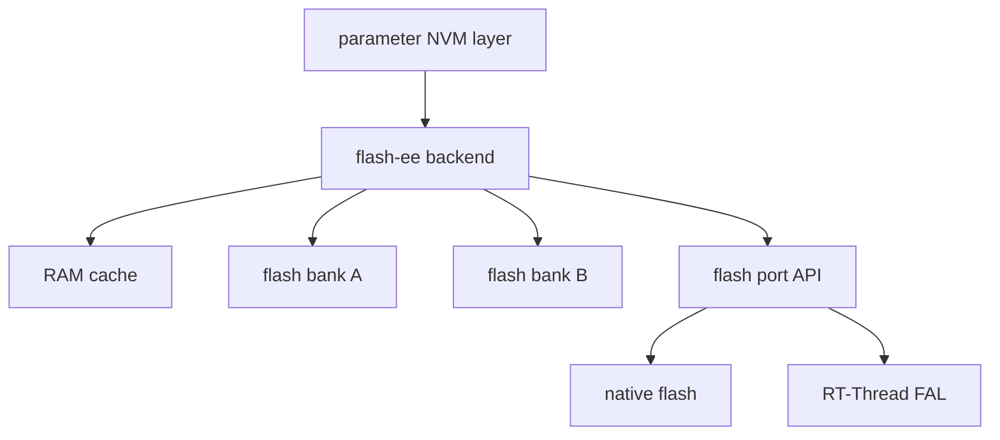
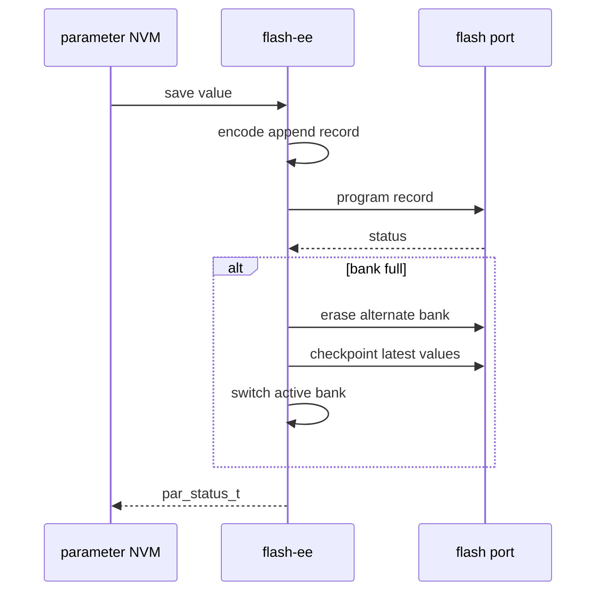

[English](./flash-ee-backend-design.md)

# Flash-ee 后端设计

Flash-ee 后端为参数值提供 flash 模拟 EEPROM 风格的持久化后端。

## 目标

该后端面向需要先擦后写、且适合 append-style record 的 flash 介质。它提供可移植核心，以及 native flash port 或 RT-Thread FAL partition 等具体存储提供者的适配契约。

## 高层架构

## Flash 上的数据模型

后端使用 bank metadata 加 append record。新值以追加方式写入，而不是原地重写记录。当 active bank 空间不足时，后端可以把最新可见值 checkpoint 到另一个 bank。

## RAM cache 模型

RAM cache 跟踪每个 persistent 参数的最新可见值。这样初始化后不需要每次读取都扫描整条 log，运行时访问更可预测。

## Commit 和 checkpoint 流程

## 恢复行为

初始化期间，后端扫描 bank header 和 append record，以选择最新的有效 active 数据集。恢复策略偏保守：

- header 非法、几何参数不兼容或 format version 不支持的 bank 会被拒绝。
- 只有最终 commit unit 已完整写入的 record 才可见。
- 部分写入的尾部 record 会被视为被中断的 append 并忽略，因此更早的已提交值仍可见。
- 已关闭但 metadata 或 CRC 非法的 record 会让 bank fail closed，而不是静默接受损坏历史。
- 没有有效 bank 时，后端会格式化一个新 bank，参数层必须从默认值或更高层策略重建数据。

该后端不是事务型多 record 数据库。如果多窗口 write 或 erase 失败，较早窗口可能已经提交，而后续窗口仍保持旧数据。应用若要求跨参数一致性，应尽量把必须一致的值放在一个独立提交窗口内，或增加应用级 version/commit marker。

## 请求完成语义

对该后端而言，`par_nvm_write(..., false)` 表示公共参数层不额外请求一次显式 sync；它不保证数据只停留在 RAM 中直到后续调用。

- 在一次逻辑请求中，后端可能在加载另一个窗口前先同步当前 dirty cache window。
- 成功的 write 或 erase 只有在该请求所需的最后一个 dirty window 按后端契约持久化后才返回。
- 失败的多窗口请求仍然是非事务性的，可能留下部分前缀已提交。

## 适配器契约

Flash port adapter 至少需要提供：

- 初始化和反初始化
- read
- program/write
- erase
- region size
- erase size
- program size
- 可用时提供可读后端名称

## RT-Thread 适配器

本文档为 RT-Thread 软件包集成说明两个 flash-ee 适配方向：

| 适配器 | 使用场景 |
| --- | --- |
| FAL port | 使用 RT-Thread FAL partition 作为 flash-ee 存储区域。 |
| Native port | 未使用 FAL 时直接绑定板级 flash 操作。 |

AT24CXX 类 EEPROM 存储在概念上属于另一个后端选择，不应当作 flash-ee port，因为 EEPROM 写入和擦除语义与 flash 不同。

## 集成风险

- 错误的 erase size、program size、line size 或 bank size 会破坏 record 对齐和 bank 选择。
- 将存储区域与无关数据共享会破坏恢复假设。
- 未迁移就改变 persistent ID 或布局可能导致已存值失联，或触发 managed NVM 重建。
- Cache/window 大小会影响一致性：应尽量让常见参数对象完整落在一个 flash-ee cache window 内。
- 掉电测试应覆盖 append 中断、checkpoint 中断、bank-swap 中断、CRC 故障注入，以及 checkpoint 中断后的首次启动。
