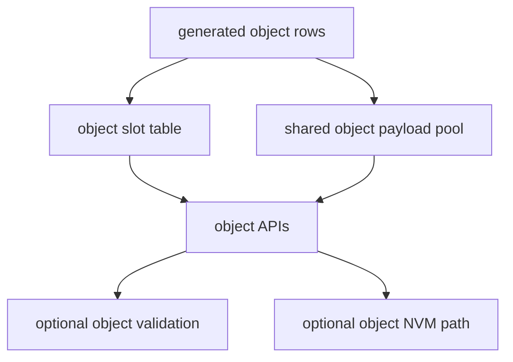

[中文](./object-parameters.zh-CN.md)

# Object parameters

Object parameters cover fixed-capacity data that does not fit scalar storage: strings, raw byte buffers, and fixed-size unsigned arrays.

## Supported object types

| Type | Typical use |
| --- | --- |
| `STR` | Human-readable strings such as SSID or labels. |
| `BYTES` | Opaque binary payloads such as keys or calibration blobs. |
| `ARR_U8` | Fixed-size byte arrays with element semantics. |
| `ARR_U16` | Fixed-size 16-bit lookup tables or calibration points. |
| `ARR_U32` | Fixed-size 32-bit lookup tables or counters. |

## Why objects are separate from scalars

Scalars are small fixed-width values. Objects have variable current length, fixed capacity, and type-specific copy/validation rules. The module keeps object APIs separate to avoid ambiguous `void *` semantics and to make buffer sizes explicit.

## Runtime model

Each object parameter owns:

- an object slot
- a pool offset
- a capacity
- a current length
- optional default data
- optional validation callback

## API rules

- Use `par_set_str()` and `par_get_str()` for strings.
- Use `par_set_bytes()` and `par_get_bytes()` for raw binary data.
- Use `par_set_arr_u8()`, `par_set_arr_u16()`, or `par_set_arr_u32()` for fixed-size unsigned arrays.
- Use `par_get_obj_len()` and `par_get_obj_capacity()` to size output buffers before reading.
- Use ID-based object APIs only when `PAR_CFG_ENABLE_ID` is enabled.

## String length rule

String capacity refers to payload capacity. Callers still need output space for the trailing NUL written by `par_get_str()`. A string with capacity `N` therefore needs an output buffer of at least `N + 1` bytes for the longest value.

## Object defaults

Object defaults are generated from the CSV table. Use default getter APIs when integration code needs to inspect the compiled default without modifying live storage.

## Object persistence

Object persistence requires:

- object type support enabled
- `PAR_CFG_NVM_OBJECT_EN` enabled
- stable external IDs enabled through `PAR_CFG_ENABLE_ID`
- backend support for the selected object storage model

Object persistence should be reviewed together with layout output because capacity and offsets become part of the persistent compatibility contract.

## RT-Thread shell behavior

When the RT-Thread package enables object display in MSH tooling, object rows can be shown in a read-oriented format. A shell write path for object rows should be added only after parsing, size limits, escaping, access checks, and role-policy enforcement are explicitly defined.
