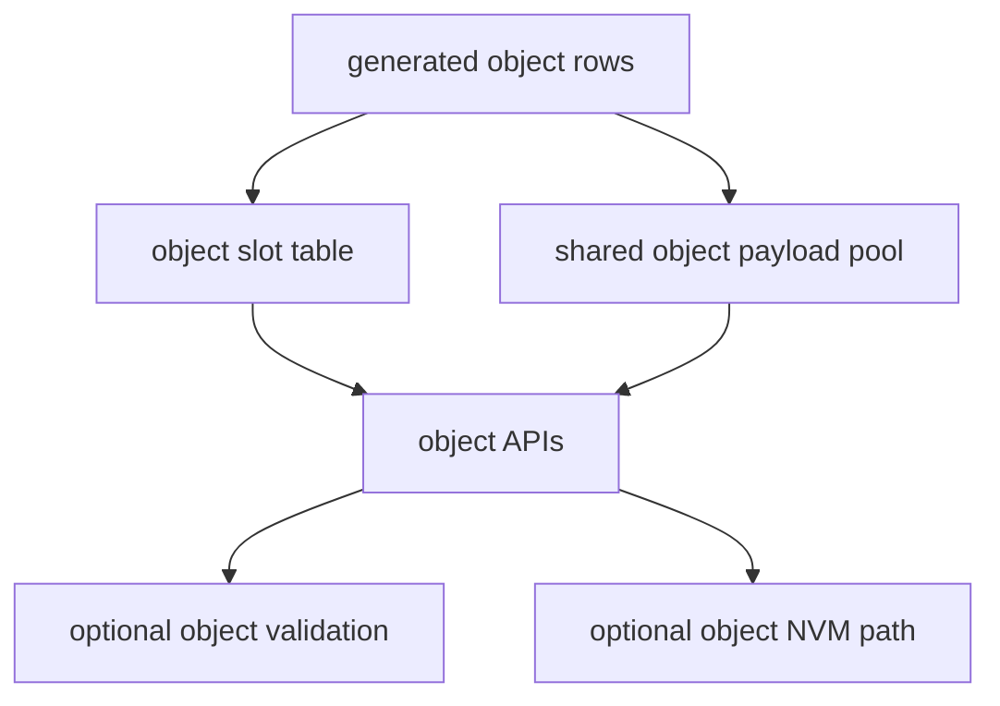

[English](./object-parameters.md)

# 对象参数

对象参数用于无法放入标量存储的定长容量数据：字符串、原始字节缓冲区和固定长度无符号数组。

## 支持的对象类型

| 类型 | 典型用途 |
| --- | --- |
| `STR` | SSID、标签等可读字符串。 |
| `BYTES` | key、校准 blob 等不透明二进制数据。 |
| `ARR_U8` | 带元素语义的固定长度字节数组。 |
| `ARR_U16` | 固定长度 16 位查找表或校准点。 |
| `ARR_U32` | 固定长度 32 位查找表或计数数组。 |

## 为什么对象与标量分离

标量是小型固定宽度值。对象具有当前长度、固定容量和类型相关的复制/校验规则。模块把对象 API 独立出来，避免模糊的 `void *` 语义，并让缓冲区大小显式化。

## 运行时模型

每个对象参数拥有：

- 一个对象槽
- 一个 pool offset
- 一个 capacity
- 一个 current length
- 可选默认数据
- 可选 validation callback

## API 规则

- 字符串使用 `par_set_str()` 和 `par_get_str()`。
- 原始二进制数据使用 `par_set_bytes()` 和 `par_get_bytes()`。
- 固定长度无符号数组使用 `par_set_arr_u8()`、`par_set_arr_u16()` 或 `par_set_arr_u32()`。
- 读取前可用 `par_get_obj_len()` 和 `par_get_obj_capacity()` 决定输出缓冲区大小。
- 仅在启用 `PAR_CFG_ENABLE_ID` 时使用 ID 版本对象 API。

## 字符串长度规则

字符串 capacity 指 payload 容量。调用者仍需要为 `par_get_str()` 写入的尾随 NUL 预留空间。因此 capacity 为 `N` 的字符串，最长值读取时输出缓冲区至少需要 `N + 1` 字节。

## 对象默认值

对象默认值由 CSV 参数表生成。当集成代码需要查看编译进来的默认值但不修改 live storage 时，可使用 default getter API。

## 对象持久化

对象持久化需要：

- 启用对象类型支持
- 启用 `PAR_CFG_NVM_OBJECT_EN`
- 通过 `PAR_CFG_ENABLE_ID` 启用稳定外部 ID
- 后端支持所选对象存储模型

对象持久化应与布局输出一起审查，因为容量和偏移会成为持久化兼容性契约的一部分。

## RT-Thread shell 行为

当 RT-Thread 软件包在 MSH 工具中启用对象显示时，对象行可按只读格式展示。对象行的 shell 写入路径只有在解析、大小限制、转义、access 检查和 role-policy enforcement 都明确定义后才应增加。
