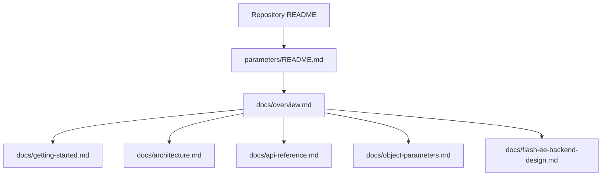

# Device Parameters documentation overview

This page is the documentation landing page for the portable `Device Parameters` module and its RT-Thread package integration.

## Reader paths

| Reader goal | Start here | Then read |
| --- | --- | --- |
| Add the module to a firmware project | [Getting started](getting-started.md) | [API reference](api-reference.md) |
| Understand internal ownership and data flow | [Architecture](architecture.md) | [Object parameters](object-parameters.md) |
| Enable or port persistent storage | [Getting started](getting-started.md) | [Flash-ee backend design](flash-ee-backend-design.md) |
| Work with fixed-capacity object rows | [Object parameters](object-parameters.md) | [API reference](api-reference.md) |
| Review runtime APIs only | [API reference](api-reference.md) | [Architecture](architecture.md) when behavior is conditional |

## Maintained documents

- [Getting started](getting-started.md): integration steps, required project files, configuration decisions, and sample table rows.
- [Architecture](architecture.md): compile-time table expansion, runtime storage, validation hooks, ID lookup, layout policy, and NVM boundaries.
- [API reference](api-reference.md): public API grouped by lifecycle, scalar access, object access, metadata, validation, callbacks, role policy, and NVM operations.
- [Object parameters](object-parameters.md): object-pool storage, string and byte-array handling, array element sizing, defaults, validation, and persistence notes.
- [Flash-ee backend design](flash-ee-backend-design.md): flash-emulated EEPROM core, two-bank model, append records, cache behavior, recovery, and adapter contracts.

## Documentation structure

Keep `parameters/README.md` as the concise module entry page. Put deep design notes, large API tables, and backend-specific details under `parameters/docs/`.
