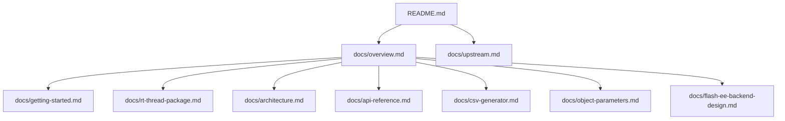

[中文](./overview.zh-CN.md)

# Documentation overview

This document is the entry point for the maintained documentation set of the RT-Thread-oriented `Device Parameters` repository.

## Repository scope

The repository contains a portable parameter manager core and documentation for RT-Thread package integration. The core is based on upstream [`GeneralEmbeddedCLibraries/parameters`](https://github.com/GeneralEmbeddedCLibraries/parameters) commit `a4ad57ffa43b17d88333c2e63ce4e45a5651f7d9`, with local extensions for RT-Thread integration, NVM backends, metadata, object parameters, generated layout options, and validation hooks.

## Reader paths

| Reader goal | Start here | Then read |
| --- | --- | --- |
| Add the module to a firmware build | [Getting started](./getting-started.md) | [API reference](./api-reference.md) |
| Integrate as an RT-Thread package | [RT-Thread package](./rt-thread-package.md) | [Flash-ee backend design](./flash-ee-backend-design.md) |
| Understand internal ownership and data flow | [Architecture](./architecture.md) | [Object parameters](./object-parameters.md) |
| Maintain the parameter table | [CSV generator](./csv-generator.md) | [Architecture](./architecture.md) |
| Review upstream provenance | [Upstream relationship](./upstream.md) | [Changelog](../CHANGE_LOG.md) |

## Document set

- [Getting started](./getting-started.md): integration checklist, configuration choices, generation workflow, and first runtime calls.
- [RT-Thread package](./rt-thread-package.md): Kconfig/SCons expectations, port layer, MSH tooling, and RT-Thread NVM backend choices.
- [Architecture](./architecture.md): data ownership, generated artifacts, validation, ID lookup, layout policy, persistence boundaries, and port boundaries.
- [API reference](./api-reference.md): public APIs grouped by lifecycle, scalar access, object access, metadata, registration, and NVM.
- [CSV generator](./csv-generator.md): CSV fields, ID ranges, lock file, generated layout files, and regeneration workflow.
- [Object parameters](./object-parameters.md): fixed-capacity object model, storage pool, dedicated APIs, and object persistence constraints.
- [Flash-ee backend design](./flash-ee-backend-design.md): flash-emulated EEPROM model, bank switching, record visibility, and adapter contracts.
- [Upstream relationship](./upstream.md): import baseline, local extension policy, and synchronization rules.

## Documentation structure

## Maintenance rule

Keep `README.md` concise and use `docs/` for detailed design, package integration, API, backend, and maintenance topics. Each maintained English document has a Chinese counterpart with the same stem and `.zh-CN.md` suffix.
