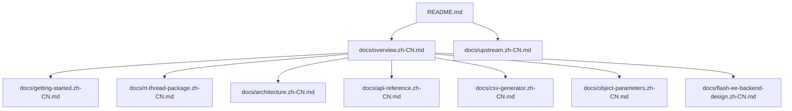

[English](./overview.md)

# 文档总览

本文档是面向 RT-Thread 的 `Device Parameters` 仓库文档入口。

## 仓库范围

本仓库包含可移植参数管理器核心，以及 RT-Thread 软件包集成说明。核心基于上游 [`GeneralEmbeddedCLibraries/parameters`](https://github.com/GeneralEmbeddedCLibraries/parameters) 的 `a4ad57ffa43b17d88333c2e63ce4e45a5651f7d9` commit，并在本仓库中扩展 RT-Thread 集成、NVM 后端、元数据、对象参数、生成布局选项和校验钩子。

## 阅读路径

| 目标 | 起点 | 后续阅读 |
| --- | --- | --- |
| 将模块加入固件构建 | [快速开始](./getting-started.zh-CN.md) | [API 参考](./api-reference.zh-CN.md) |
| 作为 RT-Thread 软件包集成 | [RT-Thread 软件包](./rt-thread-package.zh-CN.md) | [Flash-ee 后端设计](./flash-ee-backend-design.zh-CN.md) |
| 理解内部所有权和数据流 | [架构](./architecture.zh-CN.md) | [对象参数](./object-parameters.zh-CN.md) |
| 维护参数表 | [CSV 生成器](./csv-generator.zh-CN.md) | [架构](./architecture.zh-CN.md) |
| 审查上游来源 | [上游关系](./upstream.zh-CN.md) | [变更记录](../CHANGE_LOG.zh-CN.md) |

## 文档集合

- [快速开始](./getting-started.zh-CN.md)：集成检查表、配置选择、生成流程和首次运行时调用。
- [RT-Thread 软件包](./rt-thread-package.zh-CN.md)：Kconfig/SCons 预期、移植层、MSH 工具和 RT-Thread NVM 后端选择。
- [架构](./architecture.zh-CN.md)：数据所有权、生成产物、校验、ID 查找、布局策略、持久化边界和移植边界。
- [API 参考](./api-reference.zh-CN.md)：按生命周期、标量访问、对象访问、元数据、注册和 NVM 分组的公共 API。
- [CSV 生成器](./csv-generator.zh-CN.md)：CSV 字段、ID 范围、锁文件、生成布局文件和重新生成流程。
- [对象参数](./object-parameters.zh-CN.md)：定长容量对象模型、存储池、专用 API 和对象持久化约束。
- [Flash-ee 后端设计](./flash-ee-backend-design.zh-CN.md)：flash 模拟 EEPROM 模型、bank 切换、记录可见性和适配器契约。
- [上游关系](./upstream.zh-CN.md)：导入基线、本地扩展策略和同步规则。

## 文档结构

## 维护规则

保持 `README.md` 简洁，把详细设计、软件包集成、API、后端和维护主题放在 `docs/` 下。每个维护中的英文文档都有同名中文对应页，中文文件名使用 `.zh-CN.md` 后缀。
