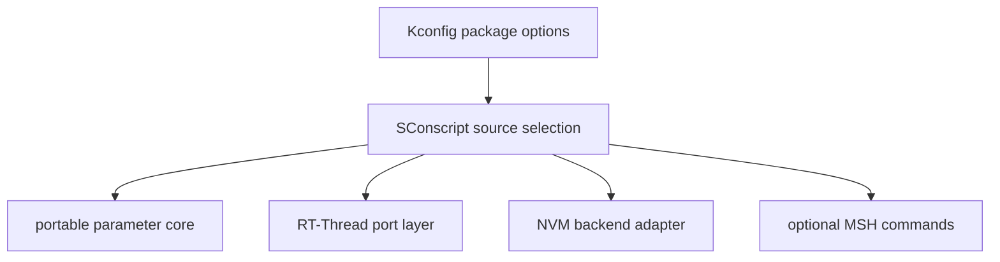

[中文](./rt-thread-package.zh-CN.md)

# RT-Thread package integration

This page documents how this portable parameter manager is expected to be wrapped as an RT-Thread package.

## Scope

The portable core lives in this repository. A complete RT-Thread package wrapper should add or maintain:

- Kconfig options for feature selection.
- SConscript integration for source selection.
- RT-Thread port glue for mutex, logging, assert, atomic, heap, and shell dependencies.
- Optional MSH commands for parameter inspection and maintenance.
- NVM backend adapters for AT24CXX and flash-ee FAL/native storage.

## Build integration

The SConscript layer should include only sources required by the selected feature set. Avoid compiling unused backend adapters or shell tooling by default.

## Kconfig option groups

Recommended option groups:

| Group | Examples |
| --- | --- |
| Core features | float support, object types, metadata fields, ID support, runtime validation, change callbacks. |
| Layout | compile-scan layout vs generated static layout. |
| NVM | NVM enable, scalar/object persistence, selected backend. |
| RT-Thread port | mutex, logging, assert, atomic backend, heap-dependent features. |
| Shell | MSH command enable, object display enable, JSON/info output options. |

## Port layer responsibilities

The RT-Thread port layer should map the portable interfaces to RT-Thread primitives:

- mutex creation, acquire, release, and timeout handling
- logging to RT-Thread logging or console facilities
- assert behavior
- atomic load/store if the default C backend is not sufficient
- optional shell role/group policy hook
- backend initialization and binding

Keep platform-specific code outside the portable core whenever possible.

## MSH tooling

MSH commands are integration-facing tooling, not the core API. They should enforce access policy explicitly before reading or writing externally visible values.

Recommended command responsibilities:

| Command area | Responsibility |
| --- | --- |
| `get` | Read scalar values by ID or name; optionally display object values in a read-only format. |
| `set` | Write scalar values after parsing, access check, range check, and validation. |
| `info` | Show metadata such as type, range, unit, description, persistent flag, and role metadata. |
| `json` | Export machine-readable metadata/value information when enabled. |
| `save` | Trigger NVM save operations for persistent parameters. |
| `def` / `def_all` | Maintenance path for restoring defaults. |

Object writes through shell should remain disabled unless the package defines strict parsing and size rules.

## NVM backend choices

| Backend | Storage medium | Notes |
| --- | --- | --- |
| RT-Thread AT24CXX | External EEPROM | Good fit for byte-addressable EEPROM devices. Requires I2C/device readiness and write-cycle handling. |
| Flash-ee FAL | RT-Thread FAL partition | Good fit when the board already uses FAL and a dedicated partition can be reserved. |
| Flash-ee native | Board flash driver | Good fit when FAL is not used and board-specific flash operations are available. |

Only one backend should own a given persistent storage region.

## Integration validation

Before releasing a package configuration, validate:

- clean build with each intended Kconfig combination
- `par_init()` success path and failure paths
- shell read/write access checks
- role-policy behavior if enabled
- NVM save/restore for persistent scalar rows
- object display and object persistence if enabled
- power-loss recovery for the selected NVM backend
- regenerated artifacts after CSV changes
