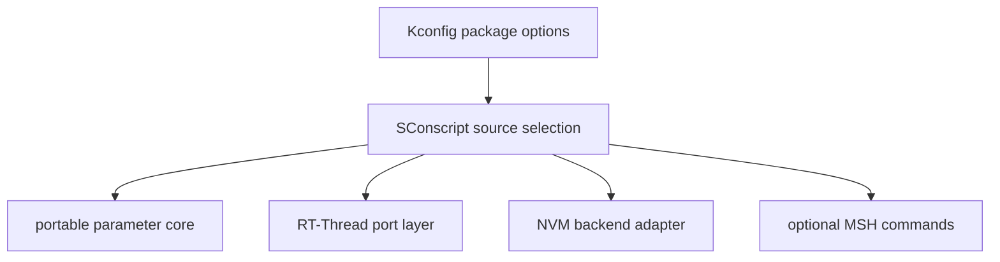

[English](./rt-thread-package.md)

# RT-Thread 软件包集成

本文说明该可移植参数管理器如何作为 RT-Thread 软件包进行封装。

## 范围

可移植核心位于本仓库。完整 RT-Thread 软件包包装层应新增或维护：

- 用于功能选择的 Kconfig 选项。
- 用于源码选择的 SConscript 集成。
- 面向 mutex、logging、assert、atomic、heap 和 shell 依赖的 RT-Thread 移植胶水。
- 可选的 MSH 命令，用于参数查看和维护。
- AT24CXX 以及 flash-ee FAL/native 存储的 NVM 后端适配器。

## 构建集成

SConscript 层应只纳入所选功能集需要的源码。默认不要编译未使用的后端适配器或 shell 工具。

## Kconfig 选项分组

推荐选项分组：

| 分组 | 示例 |
| --- | --- |
| 核心功能 | float 支持、对象类型、元数据字段、ID 支持、运行时校验、变更回调。 |
| 布局 | compile-scan layout 或生成静态 layout。 |
| NVM | NVM 使能、标量/对象持久化、所选后端。 |
| RT-Thread 移植 | mutex、logging、assert、atomic 后端、依赖 heap 的功能。 |
| Shell | MSH 命令使能、对象显示使能、JSON/info 输出选项。 |

## 移植层职责

RT-Thread 移植层应将可移植接口映射到 RT-Thread 原语：

- mutex 创建、获取、释放和超时处理
- 输出到 RT-Thread logging 或 console 设施
- assert 行为
- 默认 C 后端不足时的 atomic load/store
- 可选 shell role/group policy hook
- 后端初始化和绑定

尽量把平台相关代码放在可移植核心之外。

## MSH 工具

MSH 命令属于集成侧工具，不是核心 API。它们在读写外部可见值前应显式执行 access policy。

推荐命令职责：

| 命令范围 | 职责 |
| --- | --- |
| `get` | 按 ID 或名称读取标量值；可选以只读格式显示对象值。 |
| `set` | 完成解析、access 检查、range 检查和 validation 后写入标量值。 |
| `info` | 显示 type、range、unit、description、persistent flag、role metadata 等元数据。 |
| `json` | 启用时导出机器可读的元数据/值信息。 |
| `save` | 触发 persistent 参数的 NVM 保存。 |
| `def` / `def_all` | 用于恢复默认值的维护路径。 |

除非软件包明确定义严格的解析和大小规则，否则 shell 对象写入应保持禁用。

## NVM 后端选择

| 后端 | 存储介质 | 说明 |
| --- | --- | --- |
| RT-Thread AT24CXX | 外部 EEPROM | 适合字节寻址 EEPROM 器件。需要处理 I2C/device 就绪和写周期。 |
| Flash-ee FAL | RT-Thread FAL partition | 适合已使用 FAL 且可预留独立 partition 的板级工程。 |
| Flash-ee native | 板级 flash 驱动 | 适合未使用 FAL 且可提供板级 flash 操作的工程。 |

同一个持久化存储区域只能由一个后端拥有。

## 集成验证

发布软件包配置前应验证：

- 每个目标 Kconfig 组合能干净构建
- `par_init()` 成功路径和失败路径
- shell 读写 access 检查
- 启用时的 role-policy 行为
- persistent 标量行的 NVM save/restore
- 启用时的对象显示和对象持久化
- 所选 NVM 后端的掉电恢复
- CSV 变化后的生成产物已重新生成
